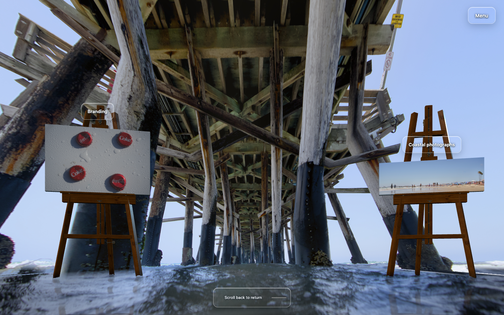
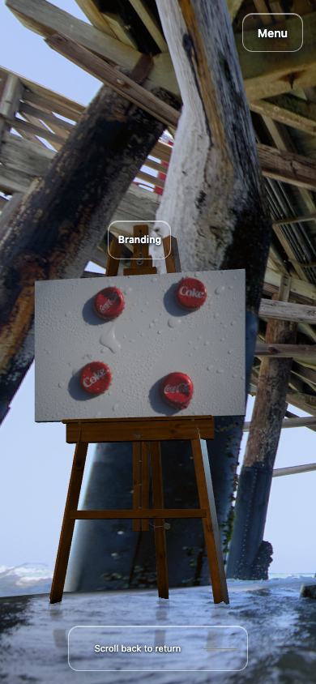
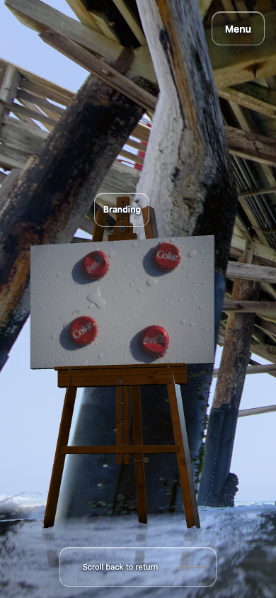

# Pier-contact experiment and retained scene

Six rendered variants of lower-foot continuations and water-contact masks did not establish a net visual improvement. The runtime is restored to the accepted `8b0c073` checkpoint. The comparisons below show why the last candidate was rejected; it is not included in the running scene.

| Retained desktop endpoint | Rejected final candidate |
| --- | --- |
|  |  |

| Retained phone endpoint | Rejected final candidate |
| --- | --- |
|  |  |

Normal water motion has independent capture times in these comparisons; the camera and print geometry match. The candidate still has a thin diagonal boundary, a pale shelf around the near foot and an unresolved gray central cap. Earlier variants also produced opaque trapezoid feet or rectangular water-sampling artifacts. Structural checks did not overrule these visible defects.

## What was tested

Four source-traced lower-foot continuations extended the existing side-wall projection beneath the water. Later variants added bounded water-sample replacement, depth-dependent transmission, conservative water-only masks, a shared camera-ray intersection with y=0, and an actual horizontal water-plane extension. Six variants each received twelve desktop/phone entry, middle and end renders in both travel directions. Across those 72 sampled poses, camera/print invariants and all 216 original photograph, video-frame and wood-map hashes were preserved, with no recorded browser/shader/HTTP failures.

This partially exercised the individual-post proposal: it tested lower-foot continuations on the existing walls, not independently positioned complete posts. None of the failed runtime variants is published.

## Why the local extension failed

The estimated camera and broad side-wall geometry disagree about the inner feet. With the protected calibration, the near inner-left source contact intersects the ground at an estimated 4.642 m, while the side wall places it at 15.005 m and 0.335 m below water. The inner-right estimates are 4.106 m versus 33.371 m and 1.069 m below water. These are calculations from visual calibration assumptions, not measurements of the pier.

Restoring those silhouettes on the walls buries substantial pieces beneath the water. Opaque extensions look pasted on; strong attenuation hides the recovered detail. Moving only the bases to their estimated ground positions creates wedges beneath the unchanged upper trunks. Separately, photographed water is mapped onto the bottom 0.15 m of the vertical side walls. Water-only masking reduced that strip but did not remove the remaining boundaries cleanly.

## Existing source coverage

The running environment uses one hero photograph. The [branded under-pier print](../../public/media/08bfbe519671b2a3ec187588.jpg) is a resized version of that same frame with a badge; comparing the upper 82% after whole-frame resizing gives RGB correlation 0.998811.

A distinct [real exterior pier photograph](../../public/media/15e20340ffa0cc99b0e6464c.jpg) is already shipped. It shows side faces, supporting posts and wet-sand/water contacts. The caption and construction suggest the same Newport Pier, but exact bay correspondence and camera registration remain unverified. A separate portrait view is heavily obscured. These real images can inform inferred geometry; they do not automatically texture every surface exposed during this walk. The 121 generated frames remain appearance references, not physical measurements.

## Retained-runtime verification

After restoration, twelve actual desktop/phone forward/reverse entry, middle and end poses matched the baseline camera, projected print quads, geometry/UVs and HUD. Fully visible artwork pixels matched exactly. Upper-region comparisons had no significant differences; 17 subthreshold pixels differed in each desktop endpoint capture. Normal water was sampled at independent times. All 216 image hashes remained unchanged and no runtime/HTTP errors were recorded.

A separate [25-check desktop/phone smoke pass](pier-restoration-checks.json) passed native wheel/emulated swipe navigation, normal idle water motion, still upper-pier pixels, reduced-motion freeze and stable runtime source hashes. Phone checks use viewport/touch emulation in desktop Chrome, not physical phone hardware. These are targeted restoration checks; the earlier 661-check full suite was not rerun for this docs-only result.

Retained environment SHA-256: `fda35aca98b47b39cc27e4d46cd6ef465bbe7bd613ba97d56c98c714d398d3cf`. Protected physical-display SHA-256: `6d1600be25caf132ef32c1ab2fca68627d6e332af75c6880809702c8946385a6`.

## Next useful geometry step

Refit a complete supporting-post group, including its upper trunk and contact, together with the background exposed when it moves. Preserve its entrance-image silhouette and compare its parallax/occlusion over the existing 0–7.5 m path and phone views. Estimated nearby contacts may pass behind the camera before the endpoint, so post backs and previously hidden water need an explicit inferred representation. The available exterior photograph can inform that work after a bay/alignment check.

The failed local-extension method does not establish that inferred reconstruction is impossible. Missing new footage is not a mandatory gate to further inferred work. A faithful measured reconstruction would require sufficient actual overlapping views or registered depth and a reviewed solve. The flattened contact band remains an open visual issue in the retained scene.
