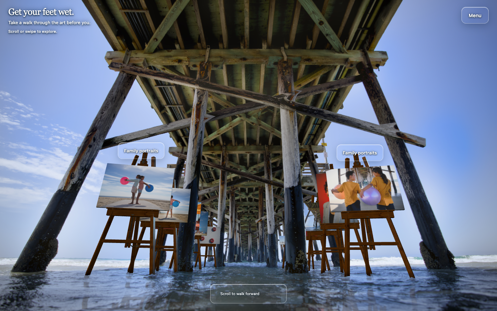
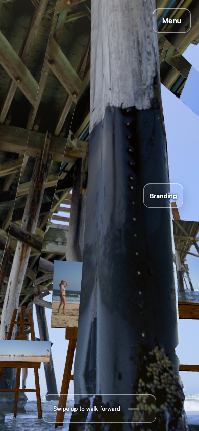
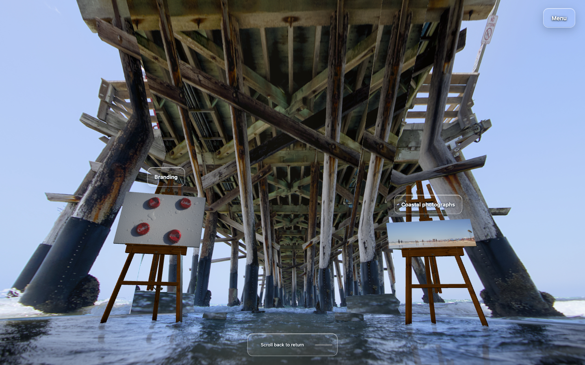

> Historical checkpoint evidence. Preserve these results with their stated source versions; they do not certify the current photograph-guided implementation. See [current review](REVIEW.md) for the active method and verification. Proposed next steps below describe that earlier stage.

# Pier registration and complete-frame prototypes

**V1 and V2 were both rejected for integration.** [Certain] V2 improves the entry silhouette, but its full walk still looks less convincing and obstructs more artwork than the accepted gallery. This registration stage leaves the accepted pier runtime unchanged; neither experimental geometry nor its fitted camera is included. The earlier [pier-contact review](PIER-CONTACT.md) records the retained scene.

## What was built

The experiment traced the nearest four complete posts, their transverse crossbeam and two braces into seven connected surfaces. Original front-facing photograph pixels were projected onto that frame, with static geometry and UVs while the camera moved through the existing 7.5 m walk. Newly visible sides and the background exposed behind the frame required inferred geometry and appearance.

| Version | Rendered result |
| --- | --- |
| V1 | Demonstrated connected posts and camera-driven parallax, but ordinary rear extrusion created black rims and striped sides. Middle/end views exposed repeated ceiling fragments, rectangular water patches and artwork obstruction. |
| V2 | Kept the rear surface behind the original front silhouette at entry, removing the black rims. Close sides still stretched limited timber texture; ceiling/sky joins and gray water patches remained. A near post hid most of the photographs at phone midpoint. |

Desktop and emulated-phone entry, middle and end views were captured in both travel directions. Successful geometry checks did not override these visible defects.

## Evidence and assumptions

The shipped real exterior photograph provides another viewpoint and useful structural context. However, review accepted **zero unambiguous matching rigid points** between it and the hero; repeated post/brace patterns did not establish the same physical bay. The obscured portrait added no verified correspondence. No measured multiview reconstruction was established.

| Quantity | Meaning in the prototype |
| --- | --- |
| Focal length about 2,036 source pixels; upward pitch 24.44° | Conditional single-image estimate from deck/post directions, assuming centered square pixels, no distortion and approximately orthogonal directions. Not recovered camera metadata. |
| Camera height 0.15 m | Chosen scale assumption, not a site measurement. |
| Foreground depth about 5.47 m; upper attachment about 5.1 m | Derived under that assumed height and camera model. The shared frame is visually plausible, not surveyed. |
| Rear extent 0.28 m | Authored volume, not a measured post cross-section. |

The existing 121 video frames are explicitly AI-generated image-to-video samples. Their tracking describes 2D image motion; it supplies neither measured pier depth nor a solved metric camera. They remain useful appearance references. This does not prevent further authored scene work with the current assets.

## Rejected V2 snapshots

These are existing normal-mode captures of the isolated experiment, not the accepted runtime. They are displayed smaller here; the linked PNGs retain their captured pixels.

Entry: the black rims are removed, but this view alone does not establish full-walk acceptance.

Phone midpoint: the near post blocks the beach and pier photographs, leaving narrow visible strips.

Desktop endpoint: straight-edged gray water patches remain around the vacated post regions.

## Feasible next work

Build one authored next bay behind the foreground frame: connected farther posts, beams and braces, explicit sky openings and horizontal water. Give exposed post sides coherent closed shapes and materials, with timber grain running along each member instead of stretching narrow screen samples. Reconcile solid-post placement with gallery sightlines, then compare the same entry, middle and end views.

That next bay and material pass is not implemented by this stage. It is feasible with the existing sources and geometry tools; new footage is not a mandatory prerequisite. Any unseen faces remain authored. Faithful measurement would additionally require verified shared landmarks, camera/crop constraints and a scale reference.
