# Dimensional easels, printed canvas and the photographic walk

Draft for collaboration. This is an improved working scene; the single-image pier reconstruction and experimental video are not approved as a photoreal production release.

## Feedback addressed

The previous view combined flat-looking dark supports, brightly pasted image planes, weak water contact and a long virtual walk against a fixed photograph. The dimensional print geometry in the recovered patch already preserved source ratios; the old video affine transforms and square DOM fallback were separate paths. A 24-by-24 example was interpreted as fixed physical proportions, not a request to square every photograph.

- The browser now uses geometry actually built, exported and rendered in Blender. CC0 Coated Pine maps have verified source hashes and a redistribution record.
- Prints retain the full front composition and source ratio, with fixed 1.05 m long-edge dimensions. Their 38 mm wrapped shell, subtle weave, worked edges, rear wood stretcher, folded cloth and staples make them physical objects.
- Neutral canvas-only fill keeps artwork brighter while preserving woven diffuse response. Original photo files, pier exposure and timber light remain unchanged by that fill.
- One camera governs the prints, easels, proxy environment, waterline and reflection pass. The 7.5 m path and row spacing expose the final bottle-cap and coastal prints after preceding supports pass.
- The water visibly moves while the camera is idle; upper pier and artwork geometry remain still. Wet contacts, underwater attenuation and distorted reflected geometry share y=0.
- Native vertical wheel/trackpad and touch scrolling work immediately, including under system reduced motion. That preference disables ambient motion. Phone viewing is guided across artwork pairs by the user's scroll position. Source-frustum checks keep supported views inside the available photograph.
- Clear floating controls replace opaque surfaces. The caption sits away from the central aisle. Optional controls live inside Menu. The HUD has one text owner and stable dimensions; the alternating-label jitter is removed.

## Reproduce

```sh
npm run check
LIVE_RELOAD=1 PORT=4274 npm start
```

The website runs from vendored browser dependencies. For automated browser checks, install Playwright separately or point `PLAYWRIGHT_MODULE` to an existing installation, then run `node scripts/qa-easel.mjs`. `QA_OUTPUT` selects an evidence directory; the default is a temporary directory. The browser test uses an installed Chrome channel and launches a separate profile. `scripts/record-easel.mjs` records a continuous native-scroll traversal.

The asset review at `/aisle/assets/review.html` shows the actual runtime model from oblique, rear and canvas-edge views. Portable Blender generation and GLB conversion scripts are included with the assets. Private construction-reference photos are not included.

## Construction evidence

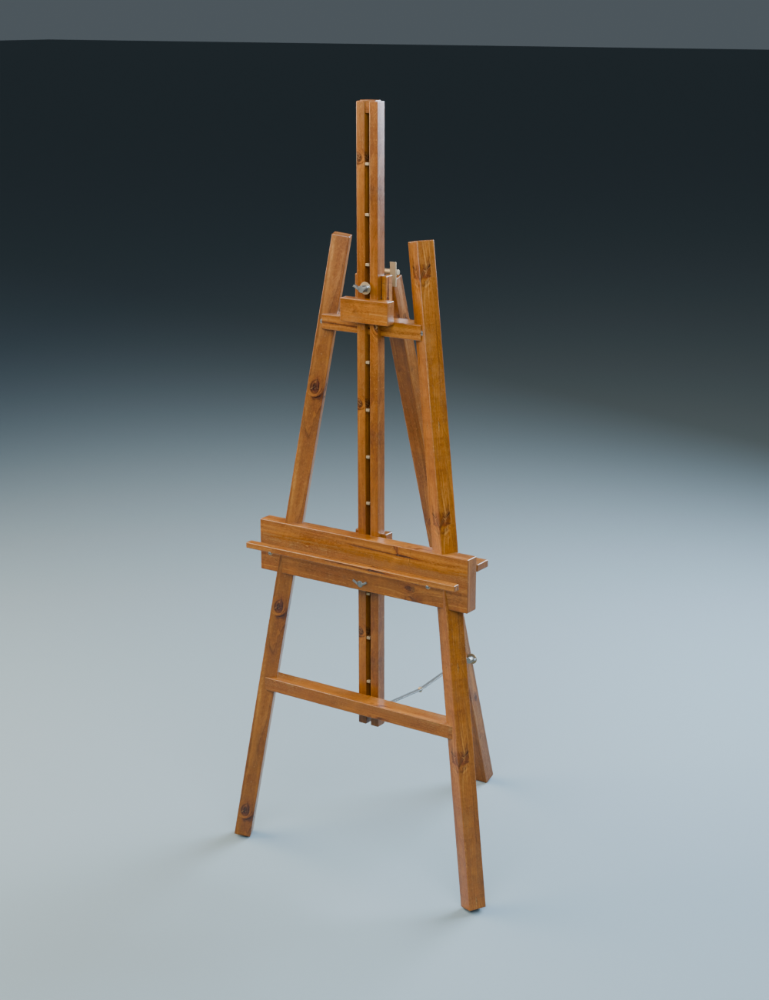

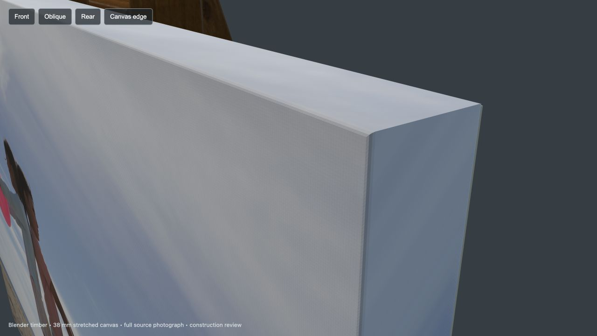

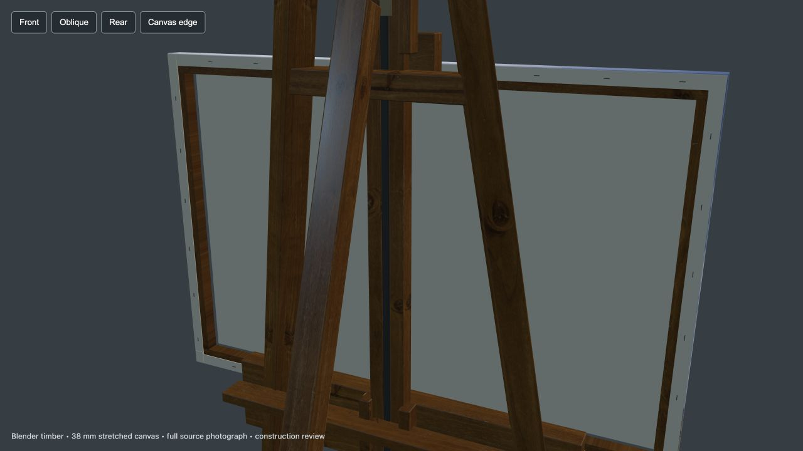

## Validation

Checkpoint browser acceptance at commit `6eda83b`: **661/661 checks passed**, no failed assertions, no missing test diagnostics and no console/asset failures. Both desktop and phone emulation sampled all 121 video frames in both directions, real print geometry/UVs and source ratios, native wheel and emulated touch gestures, explicit Still behavior, system reduced motion, idle water differences, menu/category/detail and focus return, final Coke/panorama visibility and click targets. Runtime source hashes stayed unchanged during the run. A separate 60-frame HUD probe found one stable layout; a reload probe preserved exact normalized progress and view mode.

The bundled `npm run check` also passes: all 92 existing photograph hashes match, 69 category entries and ten slots remain present, all 121 video-frame hashes match, and server private-path/write-method probes pass.

| Earlier recovered view | Current entrance |
| --- | --- |
| 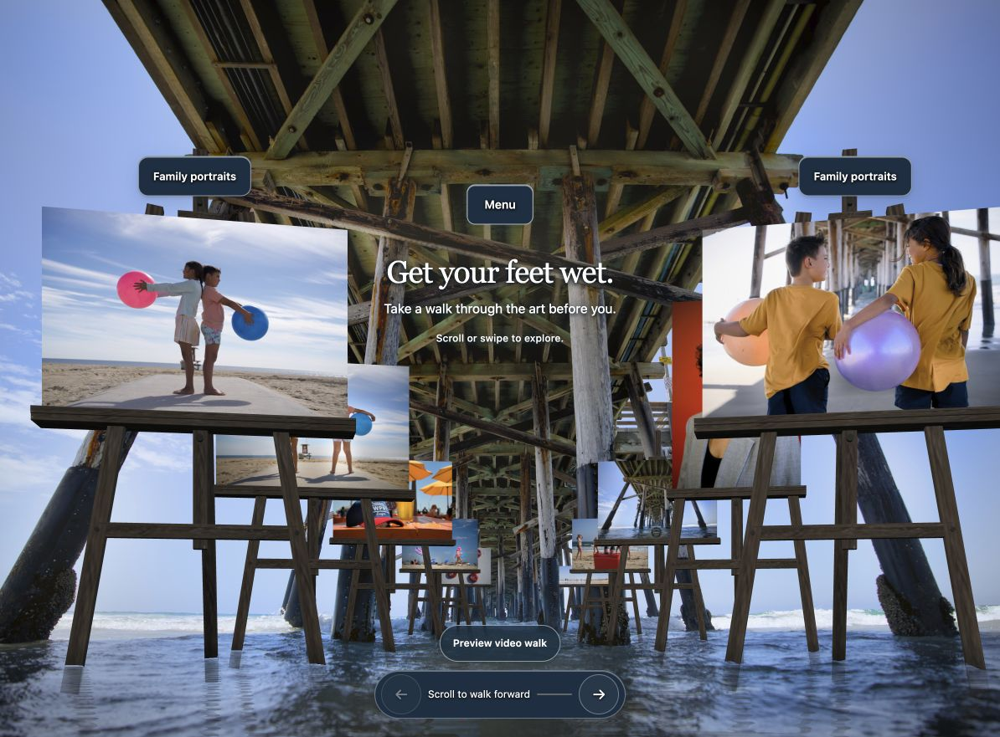 | 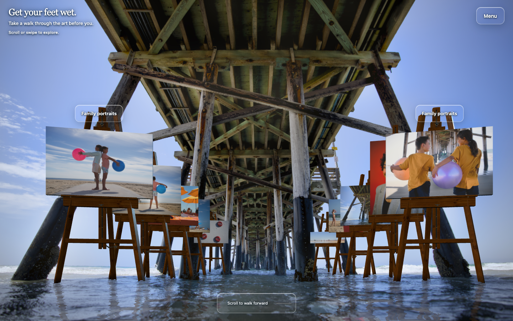 |

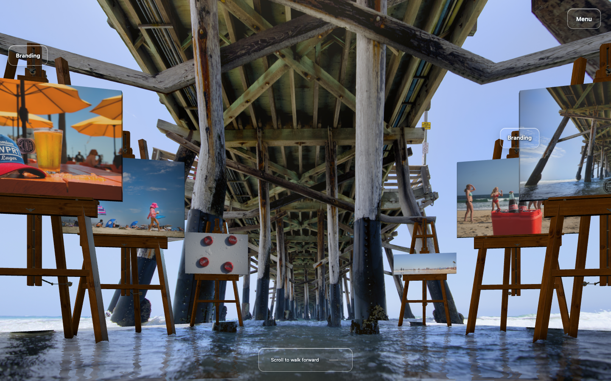

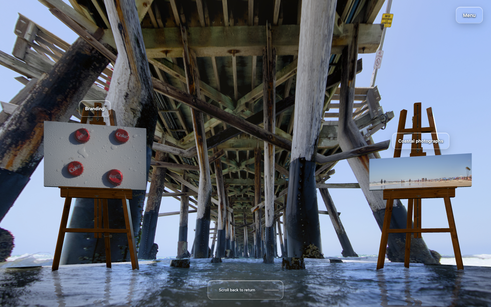

| Phone bottle-cap print | Phone panoramic print |
| --- | --- |
| 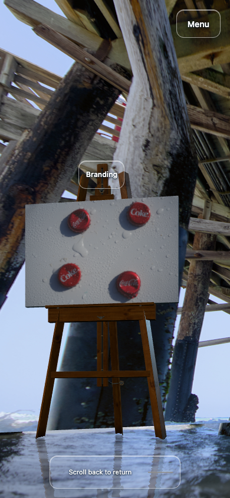 | 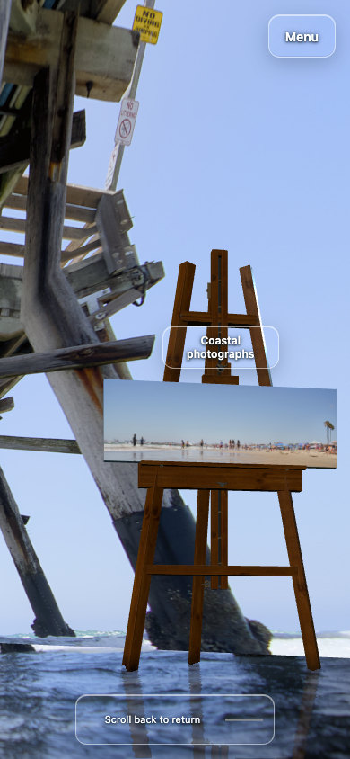 |

Automated checks establish behavior and source identity; they do not certify photorealism or real-device performance.

[Browser check summary](BROWSER-CHECKS.md) · [Continuous 17.8-second forward/reverse recording](continuous-forward-reverse.webm). The recording included one approximately one-second animation-frame delay; smooth performance on physical mobile hardware remains unverified.

## Water boundary follow-up

The floor and side walls sampled different projections of the photograph, creating a color discontinuity at their shared edge. The floor now returns to the side wall's exact sample along the boundary, then blends into the stabilized water within a bounded band. The entrance remains pixel-identical in the isolated comparison, and the foreground continues to move while the upper pier stays still. Reduced-motion frames remain identical.

| Isolated environment before | Bounded color blend |
| --- | --- |
| 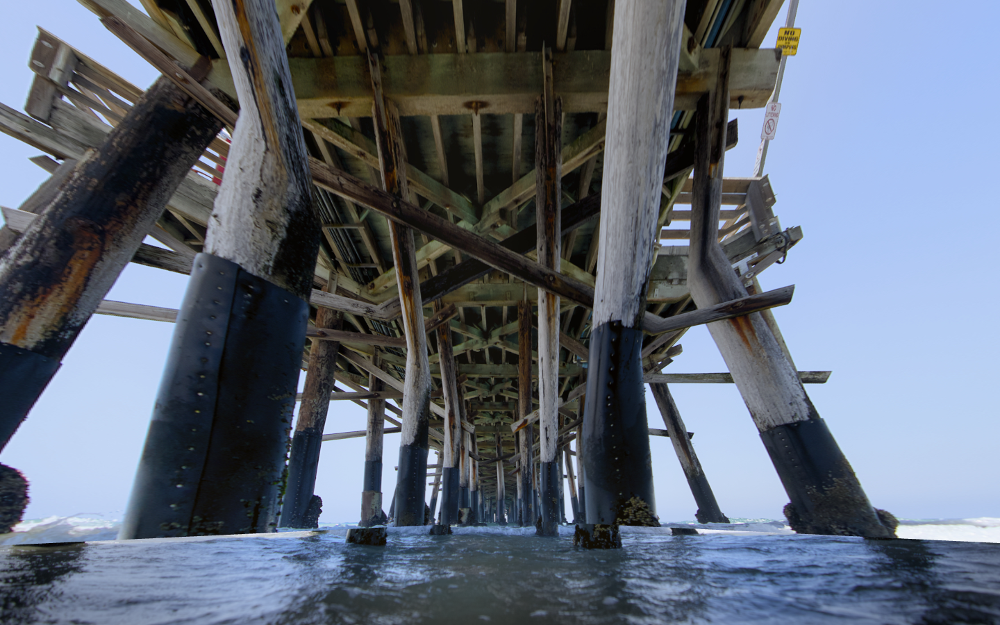 |  |

This modestly softens the join. It does not recover the photographed posts' actual depth or remove the flattened band around their feet. The gallery screenshots and recording above show the first checkpoint; this comparison documents the subsequent shader-only correction.

Follow-up verification: 16 rendered samples across desktop/phone, entrance/end and normal/reduced motion had no browser errors or exposed source bounds. All four normal-motion pairs changed in the water region with zero upper-pier changes; all four reduced-motion pairs were pixel-identical. Both texture projectors remained in bounds across 4,200 sampled rays. The tested source hash matches the final shader, and the bundled asset/server checks pass.

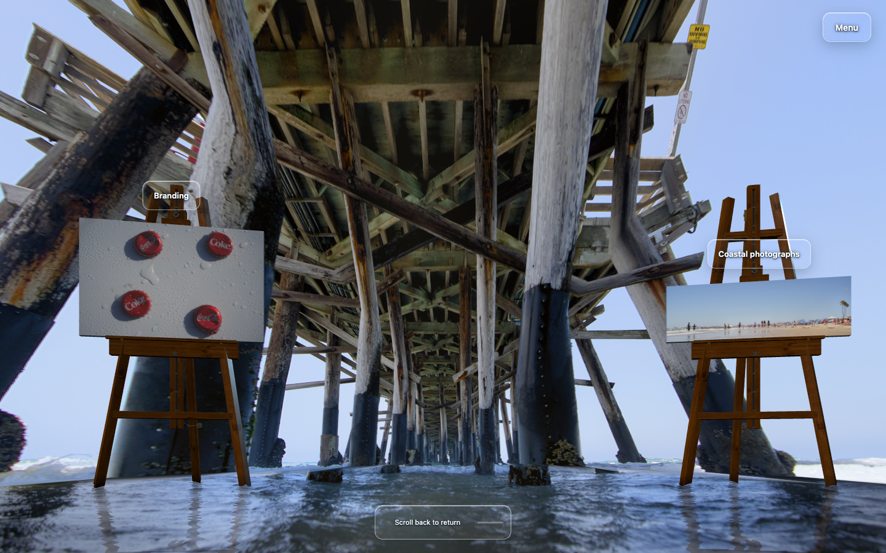

## Reflection follow-up

The reflected easel silhouettes previously formed repeated teeth and pale continuous columns. Isolating the render passes identified the planar reflection as the main cause. The reflection now follows broader wave directions, with bounded projected displacement, a soft sampling footprint and uneven transparency that lets the photographed water show through. Distortion stays near zero around the actual foot crossings. The submerged timber, camera, artwork fill and controls are unchanged.

| Same-pose previous reflection | Same-pose revised reflection |
| --- | --- |
|  |  |


The repeated teeth and broad ribbon effect are reduced, with visible foot attachment retained. The reflection remains an approximate planar rendering; its apparent geometry and wave occlusion are not a measured reconstruction of the photographed ocean.

Reflection validation: the first compact run passed 450/453 assertions. The three phone view comparisons were reproduced as test timing: the reference pose was captured before scrolling had stopped. Waiting for the existing scroll-idle condition preserved the original strict tolerances and passed all 103 targeted assertions, including those three. No application change was needed; the QA helper now uses that stable-pose precondition. Visible artwork pixels, print geometry/UVs/scales and projected quads matched at six desktop/phone entry/end/reverse poses, and every 60-frame HUD sample had one text/rectangle state. No runtime/shader errors were found; system reduced motion and native input remained functional.

## Remaining release limits

- The pier is one photograph on estimated corridor geometry. Its actual post depths, unseen faces and occlusion have not been recovered from a camera solve. Long-travel timber texture stretch is reduced but still visible.
- Photographic water motion is a restrained compositing approximation. It is not a measured wave field or fluid simulation. Water/pier contact and easel reflections still need artistic review in continuous motion.
- The easel uses a scanned repeating pine material and regular modeled cloth corners. It is more detailed than the prior supports but remains visibly computer-rendered at some angles.
- The 121 existing JPEGs sample AI-generated Seedance motion, as identified by `public/video/frames.json` and `docs/video-scroll-plan.md`. Their tracked features are 2D flow over generated imagery; no real-camera pose or metric depth solve is included. They can inform motion and appearance but do not supply independent measurements of the photographed pier. The video remains an opt-in preview.
- Viewport tests emulate phones in desktop Chrome; they do not establish performance on a physical iPhone or an actual Magic Mouse's hardware momentum.

## Smallest next visual step

The available photograph and generated frames can support an inferred reconstruction of the nearest individual pier posts and feet. Replace a small part of the broad side planes with individual proxies and irregular contact masks; preserve the entrance photograph, then verify the existing travel and phone views for exposed gaps and water-only movement. Generated frames can guide plausible overlap, but cannot establish measured geometry. New footage is not a prerequisite for this visual experiment.

Faithful recovered pier geometry would require actual overlapping photographs/video or registered depth of this pier, followed by a reviewed camera/depth solve. The current easel Blender asset does not model the pier itself. Further shader blur alone cannot provide missing individual post geometry.

This branch does not merge the separate collaborator water-shader PR, alter the upstream default branch, or deploy Pixpa/production.
