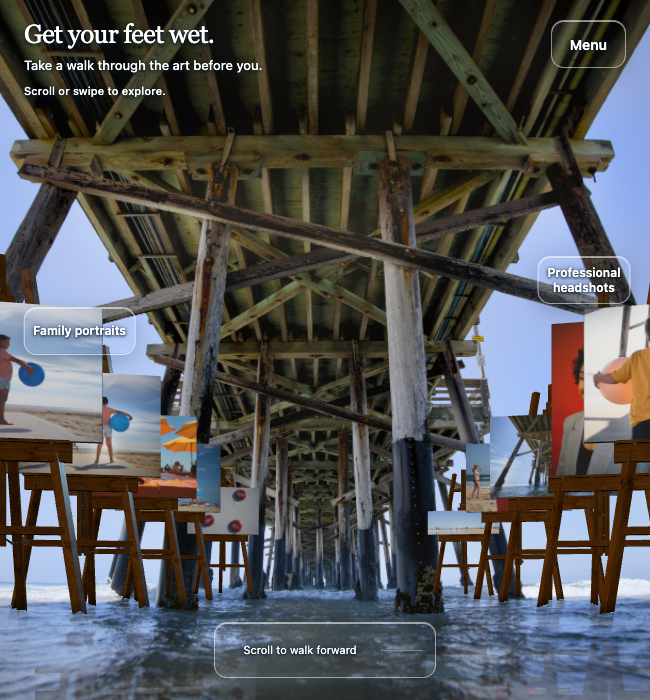
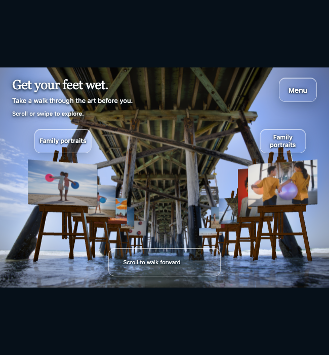
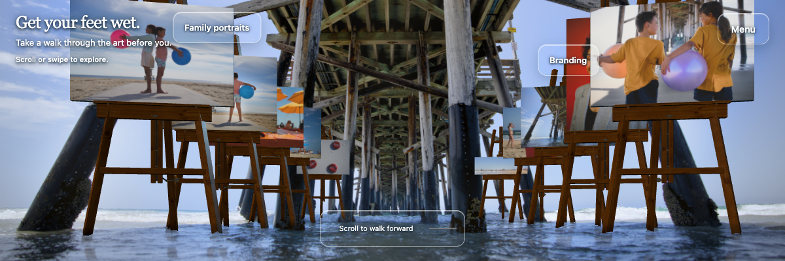
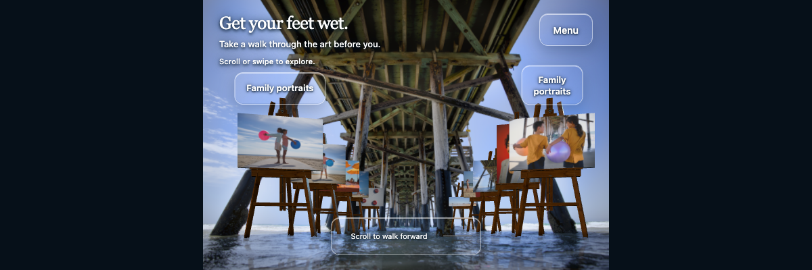
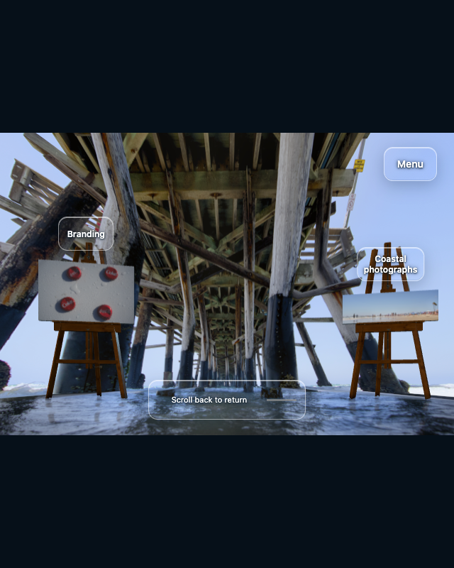
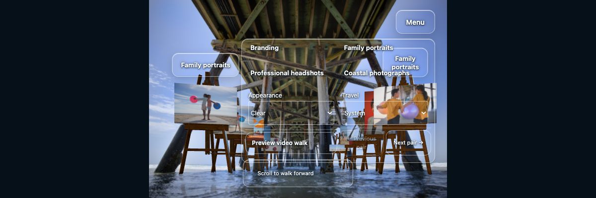
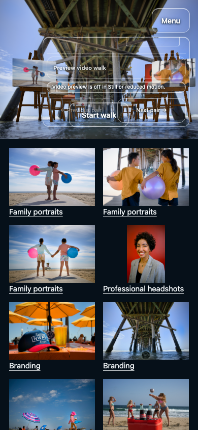

# Full scene in constrained desktop panels

The landing scene now fits both dimensions of a desktop browser panel. The source photograph and physical artwork retain their proportions. Tall panels have space above and below; wide, short panels have space at the sides. Touch phones retain the guided portrait walk and side views.

## Observed defects and fixes

1. At 650×700, source-cover framing cut most of the first pair off the sides. At 1200×400, canvas tops were cropped and controls overlapped the artwork. A source-aspect stage now contains the scene within the available width and height.
2. Menus extended beyond short scenes, including saved Still mode. Menu height now follows the rendered scene and scrolls internally, keeping its final control reachable. Side-look controls follow the camera's actual capability.
3. Simply shrinking the stage made it shift upward late in the walk and left the final stop unreachable. Rendering, Previous/Next, reload restoration, QA and recording now share a scroll range based on the full viewing area. The stage remains centered through progress 1.

## Same-size normal-motion comparisons

Before images load source at `402cb29`; after images load the final correction. Both use fresh desktop Chrome profiles at entry with normal ambient motion. These are layout comparisons, not pixel-difference claims.

| 650×700 before | 650×700 after |
| --- | --- |
|  |  |

| 1200×400 before | 1200×400 after |
| --- | --- |
|  |  |

## Verification

- **104 desktop assertions passed** across 800×900, 640×800, 599/600/601×800, 900×560/561 and 1200×400. Tests covered first/final artwork bounds, stage stability through the endpoint, native wheel input, internal menu scrolling, reachable controls, Next-pair navigation, resize and reload. Normal screenshots were independently reviewed.
- **21/21 passed in a separate 390×844 phone retest**, including native emulated swipe, full first/final artwork inspection through side views, Still, Start walk, menus and system reduced motion. No page JavaScript errors were recorded in the completed tests.
- The initial combined run remains marked failed: 118 assertions passed, then a touch wait timed out after synthetic mouse-wheel menu input. Four isolated touch trials passed; the separate phone test ran its swipe before that artificial mixed-input fixture. No application change was made for the timeout. These are separate runs, not a clean 125- or 118-check suite.
- Mid-walk development reload restored progress exactly. The test delivered a synthetic reload message to the real EventSource handler, verifying save/reload/restore behavior rather than filesystem-watch delivery.
- The physical display and photographic environment retain their protected hashes. The bundled asset/server check passes with all 92 photograph and 121 video-frame hashes unchanged.

[Compact assertion and capture evidence](viewport-fit/checks.json). The earlier 661-check suite is a historical checkpoint and was not rerun for this focused layout correction.

The exact current Codex in-app panel was unavailable for direct inspection; tests use installed Chrome viewport/touch emulation. Physical-device performance and a full accessibility or contrast audit remain unmeasured. This correction does not resolve the remaining inferred pier geometry or deploy a public site.
