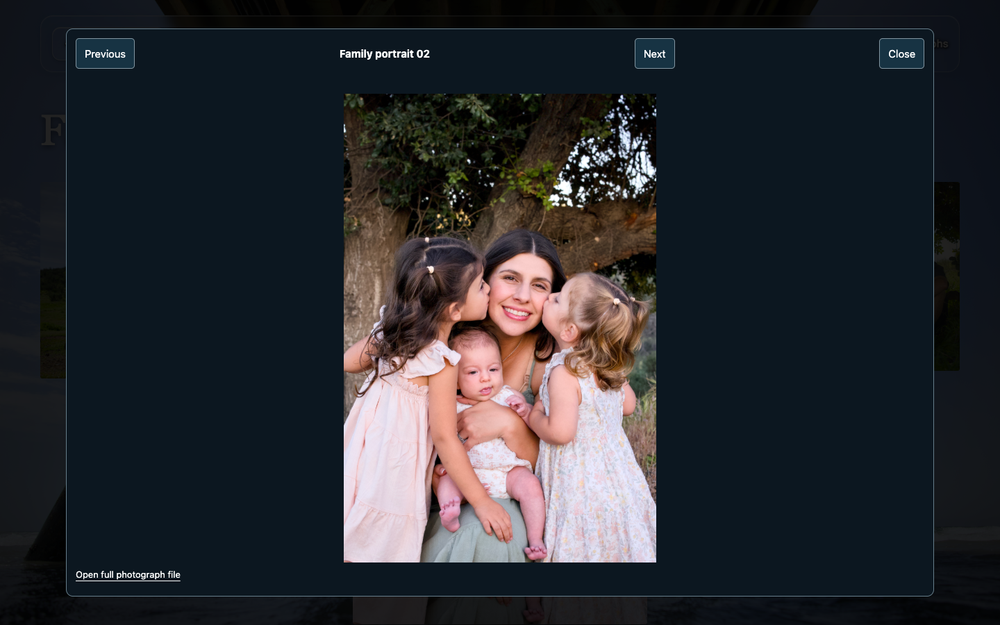
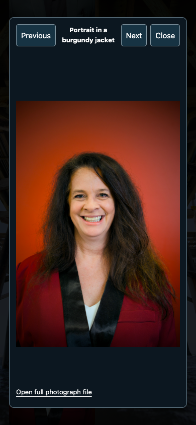
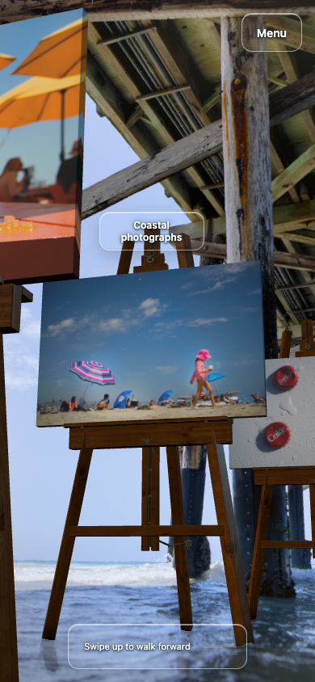
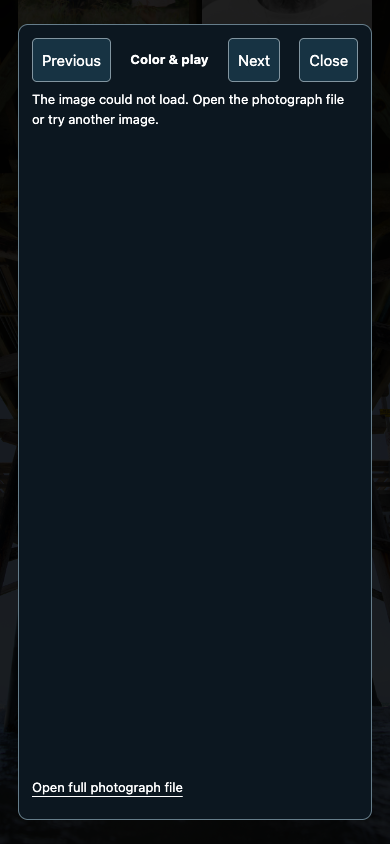
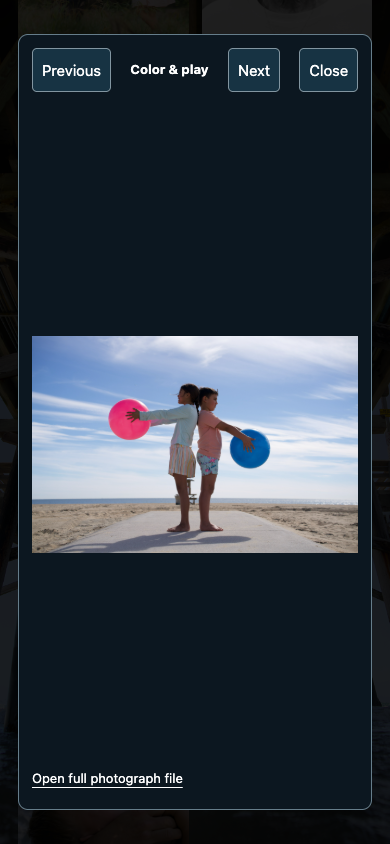

# Photograph loading and visitor navigation review

The local preview had no listener on port4274. All 88 unique collection thumbnail/full URLs failed with connection refused, and the browser could not enter the gallery. The original server tool session no longer existed and had no durable exit log, so its exact termination cause is unproven. All 88 JPEG files decoded locally; after restarting the preview, every URL returned200 image/jpeg with its original SHA256.

The replacement is a detached local Node process with closed input and file logging. Its process group is independent of the audit shell and its parent was verified as PID1. This is a local session-lifetime repair, not a system daemon or a promise across sleep, shutdown, or restart.

## Existing image paths

Against the restored e7fbfb2 runtime, actual photo-center clicks on all ten easels reached the intended collections at 1440×900 and 390×844. All 69 collection images on each layout were scrolled into view, clicked, decoded, checked for the exact expected currentSrc and visible full-image box/opacity, and captured as normal screenshots:138/138. The fourth easel intentionally introduces the first professional headshot. Original photo files and proportions remain unchanged.

The recorded request responses, per-image identity/dimensions/decoding/visibility and runtime hashes are in [image-click-evidence.json](image-click-evidence.json). Browser page errors and unexpected request failures were zero. Two requests fingerprinted an unused source GLB and received404; the actual runtime uses the existing JavaScript geometry export. This disclosed fixture result is not a missing photograph.

A controlled uncached JPEG request failure reproduced the symptom while its cached thumbnail remained visible: the browser rejected decode, the viewer showed its loading error, and the image remained hidden. Removing the failure and closing/reopening the same photo produced200 image/jpeg, a2400×1600 decode and opacity1 on both layouts. [Network recovery evidence](network-recovery.json). No speculative decoder rewrite or replacement image was needed.

## Reproduced navigation defects and correction

- Directly entering a collection, switching category, then choosing Back to the aisle incorrectly navigated out of the gallery. Category replacement now preserves whether a local aisle history entry actually exists.
- Opening a late collection image, using browser Back, then closing the remaining modal restored old collection pixels onto the aisle. Route changes now dismiss the modal, invalidate pending image results and suppress its queued scroll/focus return. The collection route owns the restored aisle position.

Both defects failed in desktop and phone browser reproduction. The candidate passed 4/4 identical route retries with stable runtime hashes and preserved normalized progress through the settled close-event window. [Before](navigation-before.json) · [After](navigation-after.json). Independent source-level review additionally checked ordinary close/focus behavior, pending decodes, same-photo/reopened-dialog races and history ownership; this complements actual browser evidence.

The reproducible helper is `scripts/qa-gallery-navigation.mjs`; its `--prepare` mode does not launch a browser. Run the real helper only with exclusive browser/GPU access and a separately running preview.

## Expanded existing visitor paths

The all-image matrix above predates the two route fixes; photograph bytes and the image-loading algorithm did not change. Exact runtime fingerprints distinguish baseline, candidate and final integration. The expanded browser matrix covers Menu and all four category/card destinations, category switches, direct reload/return, category signs, ten Still links, travel/appearance persistence, walk/look/video controls, next/previous wrap and arrow keys, full-file links, delayed decode/close/reopen races, collection resize return, and the external inquiry page. The broad run passed 89/92: two video assertions confused source-frame number120 with file sequence index60, and one popup was sampled before navigation settled. The negative report remains in [pathways-evidence.json](pathways-evidence.json). Corrected video and actual same-tab inquiry navigation passed in a [34/34 focused follow-up](fallback-and-fixture-retry.json), together with both no-JavaScript plate decodes,20 actual raw-photo link decodes, appearance reload and short-menu reachability.

One further real control defect was reproduced separately: Still displayed enabled Next pair while the camera stayed at progress0; clicking only nudged page scroll. The final patch hides and guards the pair controls in Still, preserving Start walk as the way to resume the camera. [The focused correction passed 6/6](still-controls-evidence.json): both layouts hide pair controls in explicit Still; Start walk restores functional Next/Previous and their boundaries; system reduced motion still allows pair navigation. Final accepted-preview integration/restart checks follow in the final record.

Phone input is emulated in installed Chrome. These checks do not certify physical-device performance or repair manually invented invalid URLs. The optional generated video remains in visual review. The sole external inquiry destination is read-only in this audit; no form is submitted.

## Normal browser samples

