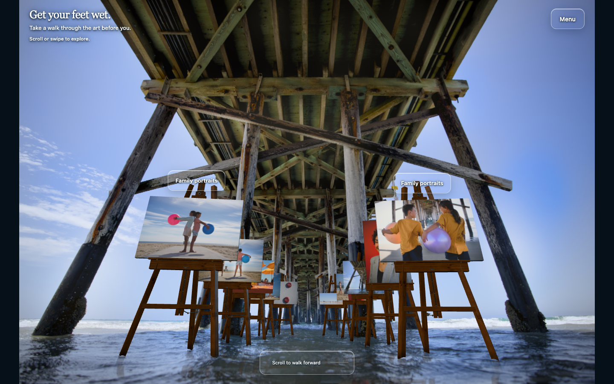
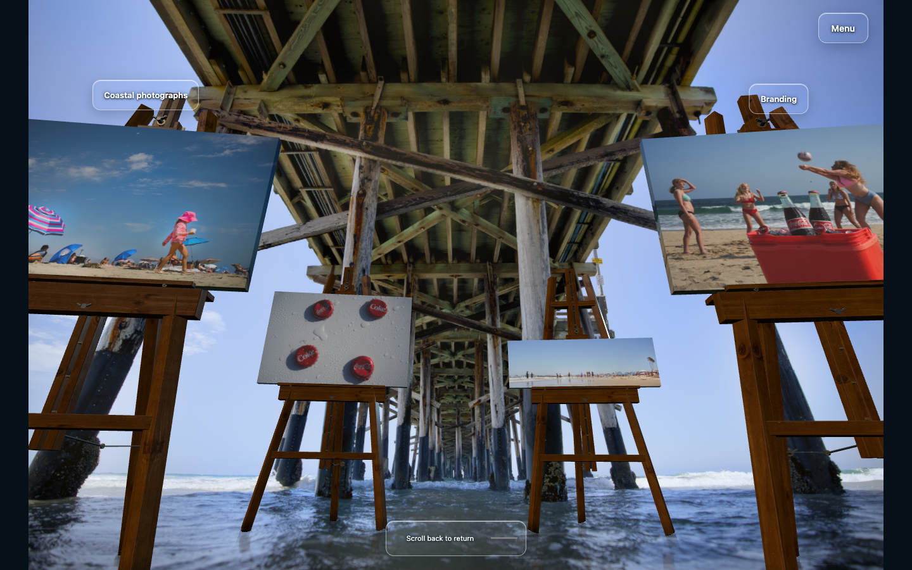

# Ten-photo rendered coverage

The frozen normal Auto candidate passed 201 actual rendered positions at each of 1440×900, 390×844 and 430×932: 603 positions total. All ten exact IDs have a clear full-photo interval of at least .025 progress and 100 scroll pixels. Selected best views were also checked with 65×49 rays against complete clones of the actual runtime easels; no other easel blocked those views. Reprojected clone corners and reported runtime corners match exactly.

| Viewport | Shortest useful progress span | Scroll pixels in this run | Smallest selected long edge | Minimum selected margin |
| --- | ---: | ---: | ---: | ---: |
| Desktop 1440×900 | .16505 | 817 | 237.12px | 88.65px |
| Phone 390×844 | .03490 | 162 | 284.31px | 39.93px |
| Phone 430×932 | .03492 | 179 | 313.94px | 43.78px |

The test records each canvas's own retaining shelf at its exact bottom boundary separately: 46–65 of 3,185 boundary-inclusive rays contact that support. Those are not other-display obstructions. All source-envelope checks passed; the original image files and 13 successfully served runtime/geometry modules remained unchanged. An extra fingerprint request for the unused source GLB returned 404; actual runtime geometry comes from easel-geometry.js, which loaded successfully. Browser runtime had zero HTTP failures or JavaScript exceptions. Intentional development-event abort messages are identified in the compact evidence.

The initial pilot exposed two fixture assumptions: fractional CSS dimensions were compared with integer render dimensions, and own-shelf edge contact was treated as another-display blockage. Correcting the fixture and waiting for populated runtime slot state produced this pass without changing app geometry. The raw report's hash and the actual interval/ray details are retained in [compact machine evidence](coverage-evidence.json).

This run predates only the final portrait scroll length increase from 650svh to 1000svh and alignment of the optional-video distance scalar. Normal camera/print poses at a given progress are unchanged; longer phone scroll intervals are verified separately. The current review does not represent this historical fingerprint as the final whole-runtime hash.

| Exact photo ID | Actual phone image | Longest useful progress interval |
| --- | --- | ---: |
| color-balls | [Full view](phone390-best-color-balls.png) | 0.0401 |
| shared-glance | [Full view](phone390-best-shared-glance.png) | 0.0549 |
| toward-the-water | [Full view](phone390-best-toward-the-water.png) | 0.0349 |
| coastal-poise | [Full view](phone390-best-coastal-poise.png) | 0.0601 |
| nwprt-hat-lager | [Full view](phone390-best-nwprt-hat-lager.png) | 0.0349 |
| nwprt-underpier-branded | [Full view](phone390-best-nwprt-underpier-branded.png) | 0.0549 |
| beach-culture | [Full view](phone390-best-beach-culture.png) | 0.0351 |
| coke-beach-campaign | [Full view](phone390-best-coke-beach-campaign.png) | 0.0549 |
| coke-beach-cold-detail | [Full view](phone390-best-coke-beach-cold-detail.png) | 0.0549 |
| coastal-panorama | [Full view](phone390-best-coastal-panorama.png) | 0.1101 |

The narrow upper-right phone sliver at the end is the preceding Coke canvas's38mm rolled side. Actual mesh rays locate it at x385–389,y100–171 in390×844; the original-photo bounds remain inside their guarded source footprint. It is not a scenery edge.

Run `node scripts/qa-photograph-coverage.mjs` against a local preview to reproduce the checks. This samples scroll poses; actual wheel/touch traversal, fixed-size/source identity and motion review are separate evidence in [verification](VERIFICATION.md). A single photograph does not provide reconstructed pier occlusion or real-device performance evidence.
