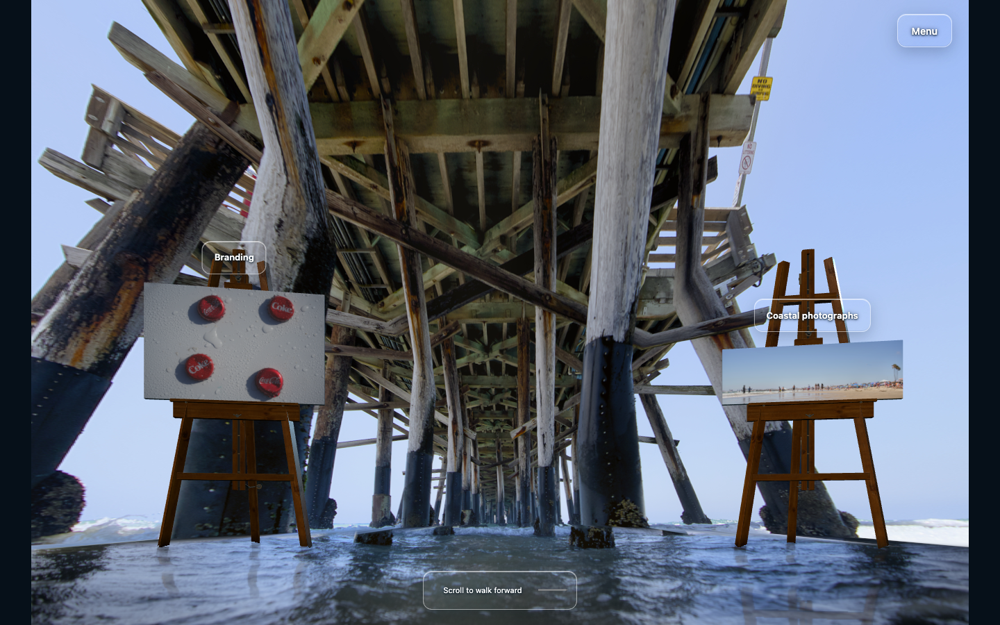
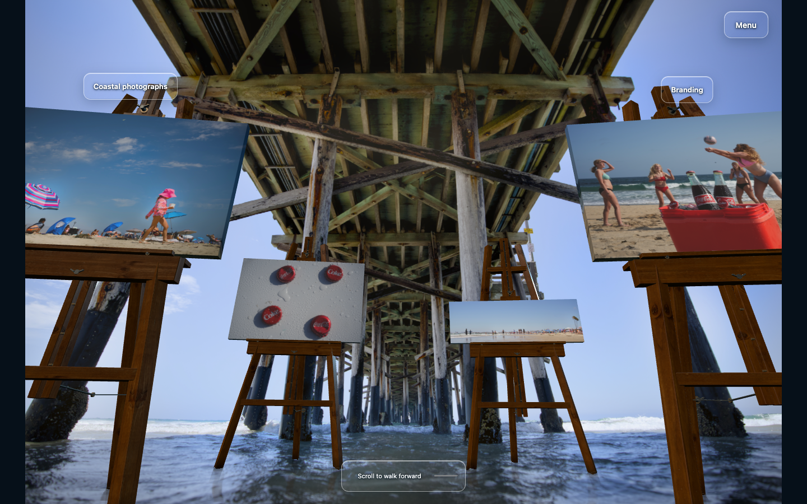
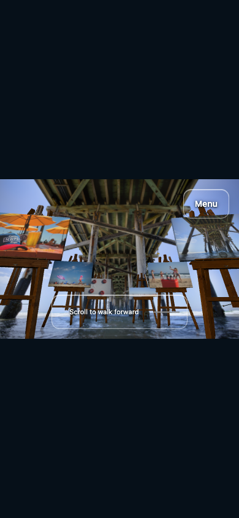

# Photograph-guided verification

The final candidate has passed the focused navigation fixes and completed normal native wheel/touch forward and reverse recordings. Independent sampled-motion review recommends it as a net gain over the preserved `004c282` checkpoint for this photographic gallery. It retains the original timber/sky/surf character and connected feet while accepting shallow background parallax and a deliberate inspection/transit rhythm. [Independent motion review](MOTION-REVIEW.md).

## Final native traversal

| Actual input | Samples | Range | Recorded result |
| --- | ---: | ---: | --- |
| Desktop wheel,1440×900 | 632 | 4,950px | 0→7m→0, no opposite-direction distance steps |
| Emulated phone touch,390×844 | 555 | 7,596px | 0→7m→0, no opposite-direction distance steps |

Both finish back at progress0 with no JavaScript/console errors. All nine recorded runtime files remain unchanged throughout the capture. [Source fingerprints and trace summary](native-evidence.json).

[Final desktop recording](desktop-native-forward-reverse.webm) · [Final phone recording](phone-native-forward-reverse.webm)

The same scripted full-swipe cadence at 650svh previously produced a sampled peak phone turn rate of174.23°/s and95th-percentile132.73°/s. At 1000svh these become110.75°/s and95.24°/s, with more centered viewing samples. These are input-trace observations, not a physical-device benchmark or a promise of comfort. The path remains eased, with slow inspection and faster connecting spans.

The protected `004c282` runtime was recorded separately with the same harness and viewport sizes:604 desktop and 396 phone samples, native forward/reverse endpoints, no runtime errors and stable eight-file fingerprints. Its path was 7.5m. [Accepted desktop baseline](accepted-desktop-native.webm) · [Accepted phone baseline](accepted-phone-native.webm) · [Baseline identity](accepted-native-evidence.json). Camera, layout and path differ by design; this is not a matched-camera or simultaneous-performance A/B.

| Accepted late-forward view | Final late-forward view |
| --- | --- |
|  |  |

These are the first native milestone frames in the rounded final progress bucket, rather than exact endpoint poses. Exact rendered endpoints and all-ten reading intervals are in [coverage](COVERAGE.md).

## Interaction evidence and corrections

The broader interaction run passed 304/306 assertions. The two failures came from test expectations built from raw geometry slots, which lack the application's category routing and professional-headshot substitution. The actual Still links were correct. A corrected, focused Still retry passed 28/28 without an app change.

A subsequent independent review found a real combined case: opening a collection at desktop progress .6, resizing while it was hidden and pressing Back returned to .391. Saving normalized progress alone was insufficient: automatic browser history restoration reapplied the old 2970px position. The final change stores normalized return state with the history entry and lets collection navigation own restoration. It also uses one pair-target resolver for both disabled state and button action.

The final focused run passed 81/81 assertions with no runtime, console or HTTP errors. Desktop→phone returns .600052659 after pixel rounding and remains there for 20 observations over roughly 2 seconds; phone→desktop returns .6. Same-size photo enlargement/return and focus, nonzero Still raw-scroll return across a resize, pair boundary states and valid neighboring targets pass. [Compact interaction evidence, including failed attempts and exact module hashes](interaction-evidence.json).



The earlier full run also verifies native entry without Start, manual look/Auto, bounded clear menus, collection/detail return, actual visible resize preservation, development reload and original physical print dimensions. It measured phone ranges 7,596px and 8,388px at 390×844 and 430×932. Its camera/water/layout/CSS hashes are identical to the final navigation-fix run; only four navigation modules changed, all covered by the focused retry and final native recordings.

## Water, reduced motion and optional video

At a fixed phone pose, normal water advances phase and changes foreground pixels over 700ms. Under system reduced motion, the entire390×844 screenshot is byte-identical after 2,000ms, with zero changed pixels, both phases zero and an unchanged camera. Independent final entrance→return comparisons also find pixel-identical roof, barnacle interiors and an actual easel shaft while foreground water changes.

At exact progress .5, the optional generated-video toggle retains 3.59m before/on/off; switching it off restores the exact photographic camera and print quads. This is one continuity check. The old 121-frame video-quality sweep was not repeated or represented as current acceptance; the generated preview remains experimental.

## Coverage, sources and reproducibility

[Coverage](COVERAGE.md) establishes useful full-photo intervals for all ten IDs at 603 sampled positions and 30 dense best views. It predates the final scroll-length/video-scalar and navigation cleanups, whose normal pose-vs-progress geometry is unchanged. That version boundary and the earlier GLB fingerprint404 are retained rather than erased.

The original 92 selected photographs, 121 generated-video samples and existing Blender/material assets are unchanged from `004c282`. `npm run check` verifies the photo/video manifest hashes, 69 category entries, 10 slots, browser-safe paths and read/write route boundaries. The final bundle result is retained with the handoff record.

Portable helpers:

```sh
QA_URL=http://localhost:4274 node scripts/qa-photograph-coverage.mjs
QA_URL=http://localhost:4274 node scripts/qa-photograph-interaction.mjs
QA_URL=http://localhost:4274 node scripts/record-photograph-walk.mjs
```

Set `PLAYWRIGHT_MODULE` for an existing Playwright installation and `QA_OUTPUT` for an evidence directory. Run browser helpers sequentially in a separate profile. `QA_ONLY=still` or `cleanup` scopes the interaction helper. Its final executed cleanup hash and subsequent exit-code/comment-only polish are distinguished in the evidence. The coverage helper was adapted from the successful capture; its portable copy was syntax-checked, not rerun as a new 603-position claim.

Native-device timing, every-frame smoothness and physical pier reconstruction remain outside the evidence. This draft does not publish Pixpa or merge the separate collaborator change. Historical browser counts and rejected reconstruction stages remain separately labeled.
