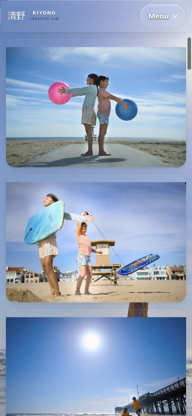
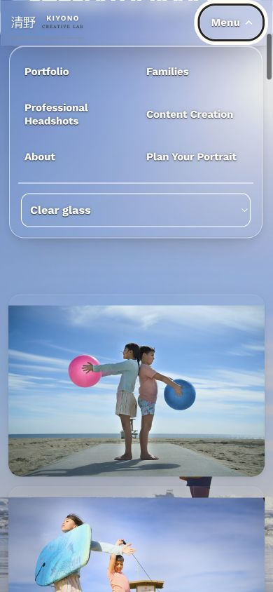
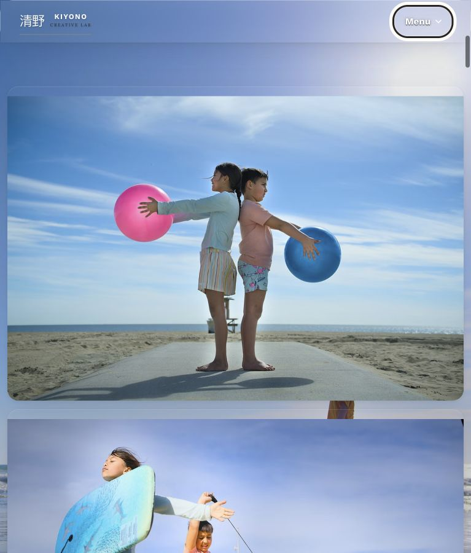
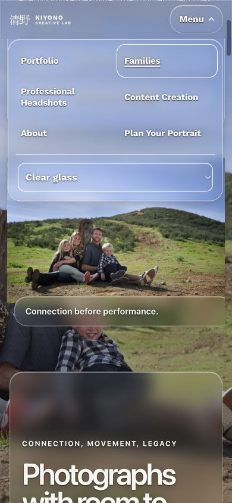

# Independent live Home masthead verification

2026-09-10 · Return: `/root` · Bounded public-browser QA only.

[Certain] **LIVE PASS in the tested Chrome scope.** The saved Home-only sticky-ancestor fix is present without an injected test style. Home390/767 retain the masthead while scrolling down and back up; Home768/1440 and Families390 controls remain sound. No new horizontal overflow, image crop/geometry, glass, or menu regression was found in the inspected states.

## Public identity

Fresh public Home and Families were opened with `header-live-independent=20260910-1855` cache-busting queries in one new disposable Chrome tab, `138375236`.

- Exact accepted CSS packet: **213 bytes**, SHA-256 `054b7b670d4cea6688aba923a7d5c9445e26236b601900a4bea9a1da57305b86`.
- Exactly **one** byte-exact packet occurrence in each public DOM, owned by existing `style#kcl-pier-home-entry-20260909`.
- Home selector match count1; Families match count0.
- No `independent-home-sticky-candidate` style or other matching header-test style existed. No CSS, script, overlay, response interception, or scroll setter was injected during this live pass.
- Home contains exactly one copy of the accepted optical script, SHA-256 `93d81d23e261dc3b72db526231c9d328e479942ebb685142f456e63849bf40d7`.

This independently verifies the public packet and rendered behavior. Full editor-field persistence and source handoff remain the publisher's separate evidence; no private full-field snapshot or source inventory is reproduced here.

## Native-scroll and interaction measurements

Normal Clear was effective in all33 measured states. Tab-only emulation set reduced-motion/reduced-transparency to no-preference, contrast no-preference, forced-colors none; `mobile:false`, DPR1. Heights were844 at390 and900 at767/768/1440. Native wheel events moved the document; the report uses actual resultingY, not requested wheel deltas.

| Public page/width | Top: documentY / mastheadTop | Down: documentY / mastheadTop | Up: documentY / mastheadTop | Native menu click |
| --- | --- | --- | --- | --- |
| Home390 | 0 / 0 | 900 / 0 | 420 / 0 | Opens atY420; no scroll change |
| Home767 | 0 / 0 | 900 / 0 | 420 / 0 | Opens atY420; no scroll change |
| Home768 | 0 / 0 | 900 / 0 | 420 / 0 | Opens atY420; no scroll change |
| Home1440 | 0 / 0 | 900 / 0 | 420 / 0 | Opens atY420; no scroll change |
| Families390 | 0 / 0 | 900 / 0 | 420 / 0 | Opens atY420; no scroll change |

All33 states: mastheadTop0; document horizontal overflow0; body horizontal overflow0. Home ancestor overflow is visible; its existing landing `clip visible` remains intact.

Open Home390 menu also stays visible during native downY560 and reverseY240. Its panel bounds are x13..375, y65..339.5. Menu panel bounds match the candidate: Home767/768 width440, y67..344; Home1440 width440, y67..376; Families390 x13..375, y65..337.5. Native click uses measured toggle coordinates and actual mouse press/release.

Supported keyboard Tab reaches Portfolio, and Escape closes the menu and restores focus to the Menu toggle on all five page/width cases. Expanded/hidden states agree with the renders. As in the candidate/control audit, locator-driven keyboard focus scrolls toward the top (Tab samplesY30 at390 andY4 atlarger widths; EscapeY0). This is retained as a tool-path limitation, not silently presented as native-key scroll-position preservation. Native clicks themselves preserveY420 in every case.

## Candidate comparison and visual check

- All23 Home images retain identical currentSrc, object-fit, object-position and filter at390/767/768/1440.
- All23 rendered image widths/heights match the retained candidate exactly at390/767/768. At1440, the matched down-scrollY900 comparison is also exact for all23. Three top-sample carousel images differed by only0.0254px width/0.0141px height between the prior slightly unsettled top sample and current top; the matched down comparison has zero differences. No meaningful ratio/crop divergence was observed.
- Wrapper heights exactly match retained candidate/control evidence at every width. The hero's top rendering, photography framing, and landing clip remain unchanged.
- Existing transparent menu background and `saturate(1.06) blur(8px)` backdrop match the candidate. No material or sheen rewrite occurred in this pass.
- While scrolling near Home390Y43, existing toggle/panel sheen pseudo-elements measured opacity0.103841, skewed transform travel, and target opacity0.14. After idle, both measured opacity0, will-change auto. The accepted optical script hash is unchanged. The moving and idle renders show the same restrained treatment; this does not expand into a new whole-site glass review.

Twenty sanitized screenshots were captured. The Home390 top/down/open-moving/open-down, Home767 down, Home768 menu, Home1440 menu, and Families390 menu renders were viewed directly. They show retained mastheads, readable menus, visible underlying photography, and no newly exposed horizontal content.

## Scope and cleanup

The agent-browser skill guided isolated ownership, rendered-state verification and cleanup. Only the public Home/Families pages were inspected; no gallery re-review, account UI, source edit, upload, Save or Publish occurred. This is Chrome width-emulation evidence, not a physical-phone or Safari certification.

[Certain] Temporary viewport/media overrides were cleared and the sole owned tab closed. Final readback: viewport1194×825, testStyles0, choiceClear/effectiveClear, original reducedMotion=true and reducedTransparency=true restored. No shared appearance choice or other tab was changed. Only this live evidence directory received files.
