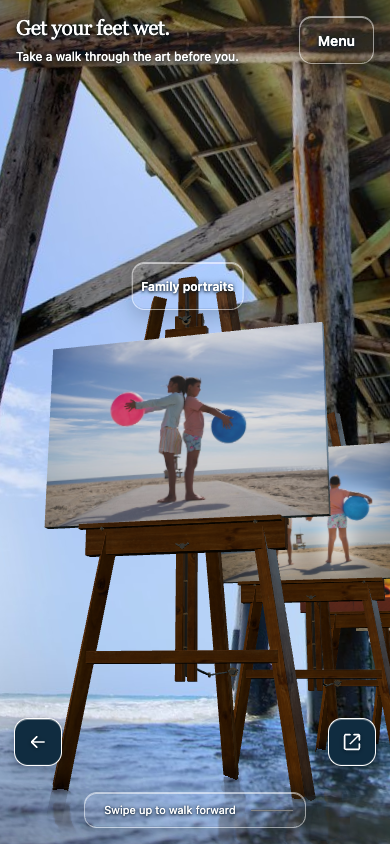
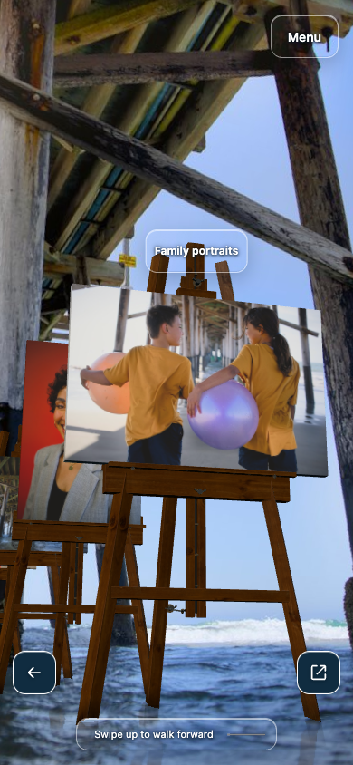
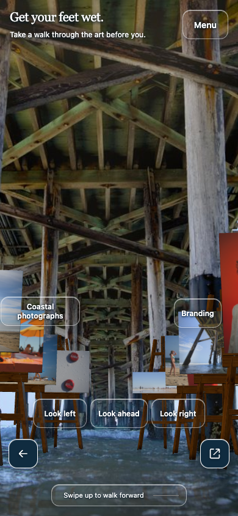
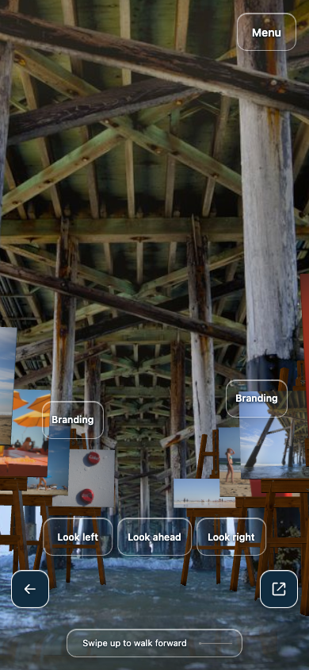
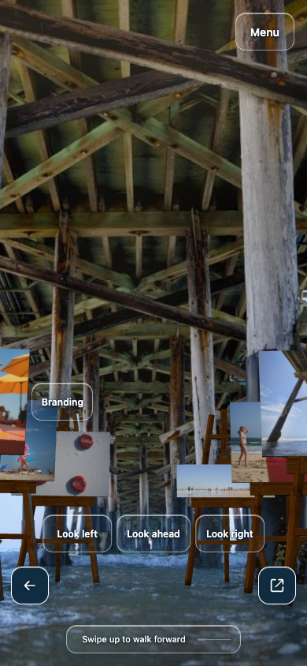
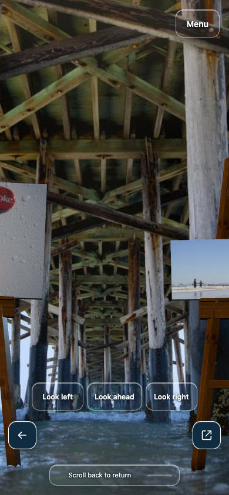
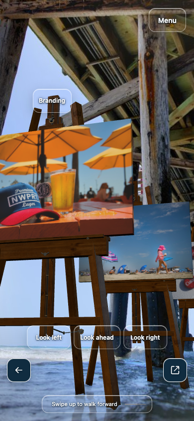
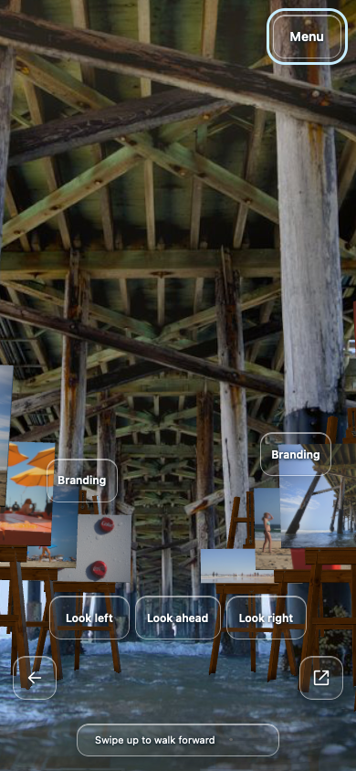
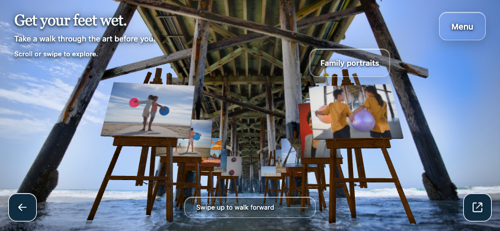
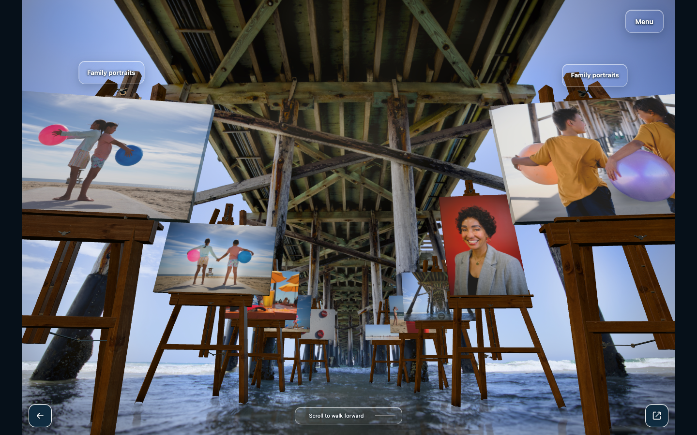

# Actual-public movement evidence

The after-repair screenshots were captured through the actual public Pixpa iframe after Sites18 deployment, without replacing resources. The separately labeled before screenshots preserve the preceding public baseline. Browser emulation is not a physical phone test.

## Before the repair

One swipe mostly rotated the camera, with only0.08825m forward travel.

## After: facing forward and walking down the aisle

## Other rendered profiles

[Measured nine-profile results](public-checks.json). No photograph identity, aspect ratio, geometry or original source crop changed. Narrow-view perspective clipping at near passes remains a documented limitation.
